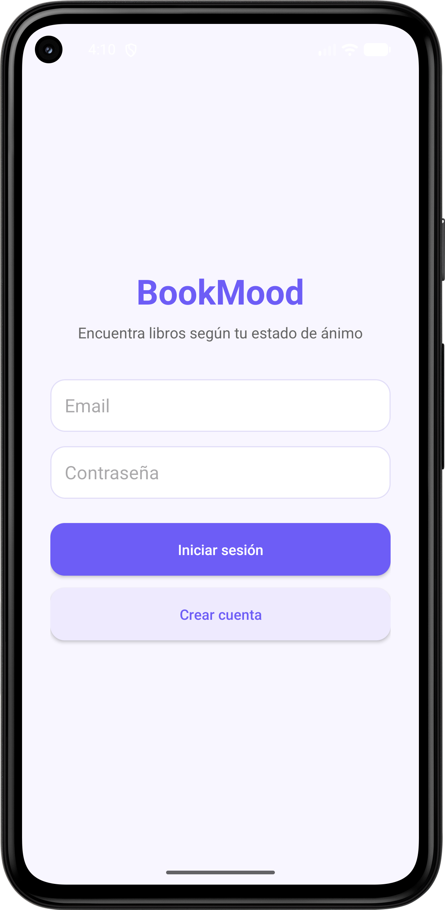
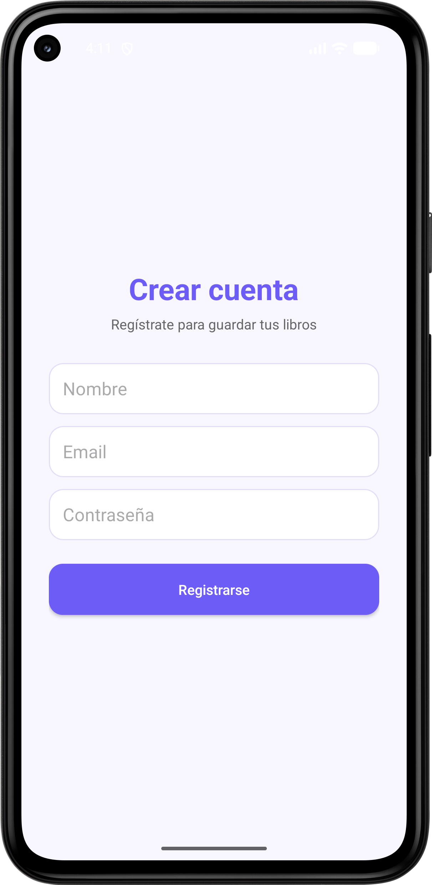
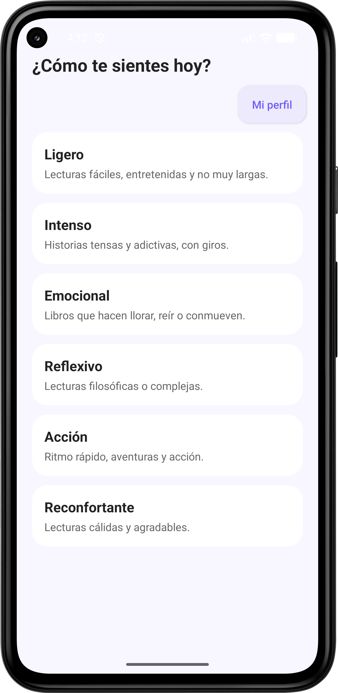
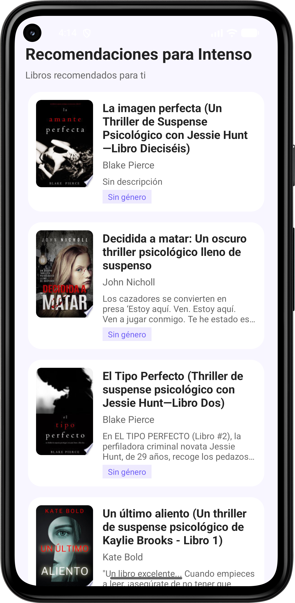
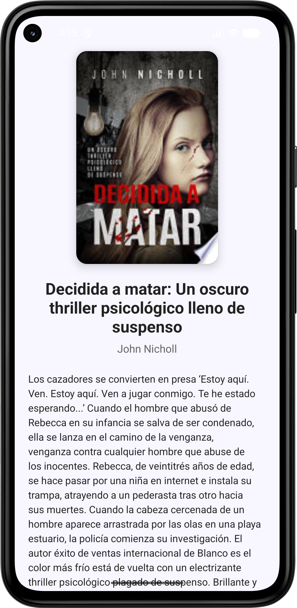
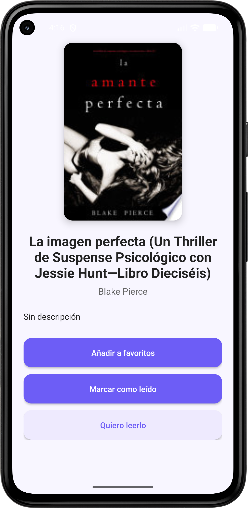
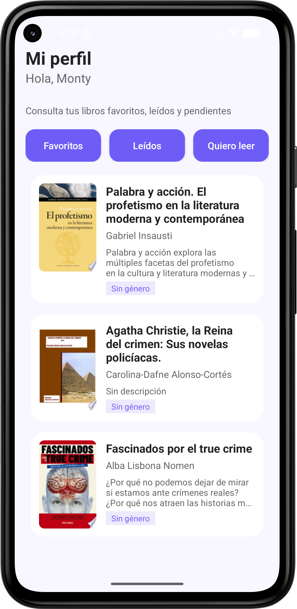

# 📚 BookMood

Aplicación móvil Android orientada al descubrimiento y recomendación de libros mediante un sistema basado en el estado de ánimo del usuario.

## 📖 Descripción

BookMood es una aplicación desarrollada como Trabajo de Fin de Grado del ciclo de Desarrollo de Aplicaciones Multiplataforma (DAM).

El objetivo principal de la aplicación es ofrecer recomendaciones de lectura personalizadas según el estado emocional del usuario, proporcionando una experiencia visual moderna e intuitiva inspirada en plataformas de contenido multimedia.

La aplicación permite:
- Registro e inicio de sesión de usuarios.
- Recomendaciones de libros según estado de ánimo.
- Visualización de libros mediante carruseles.
- Gestión de favoritos y libros leídos.
- Consulta de información detallada de cada libro.

---

## 🛠️ Tecnologías utilizadas

### Frontend
- Kotlin
- Android Studio
- Retrofit
- Material Design

### Backend
- SpringBoot
- API REST
- JWT Authentication

### Base de datos
- MySQL

### Control de versiones
- Git
- GitHub

---

## 🏗️ Arquitectura

El proyecto sigue una arquitectura cliente-servidor:

- Aplicación Android como cliente.
- Backend desarrollado con Spring Boot.
- Base de datos MySQL.
- Integración con API externa de libros.

---

## 📱 Funcionalidades principales

- Registro de usuarios
- Inicio de sesión
- Selección de estado de ánimo
- Recomendaciones personalizadas
- Gestión de favoritos
- Libros leídos / quiero leer
- Perfil de usuario

---
## 📸 Capturas de pantalla

<h3>Inicio de sesión</h3>

<h3>Crear cuenta nuevo usuario</h3>

<h3>Selección de estado de ánimo</h3>

<h3>Recomendaciones de libro</h3>

<h3>Detalle del libro</h3>

<h3>Selección de perfil</h3>

<h3>Perfil de usuario</h3>

---

## 🚀 Estado del proyecto

Proyecto desarrollado como Trabajo de Fin de Grado (TFG) para el ciclo DAM.

Actualmente el proyecto continúa en desarrollo y presenta posibilidades de ampliación futura.

---

## 👩‍💻 Autor

Montserrat Gomes Castañar

Trabajo de Fin de Grado – Desarrollo de Aplicaciones Multiplataforma

 ## 📌 Licencia

Proyecto desarrollado con un fin educativo.
